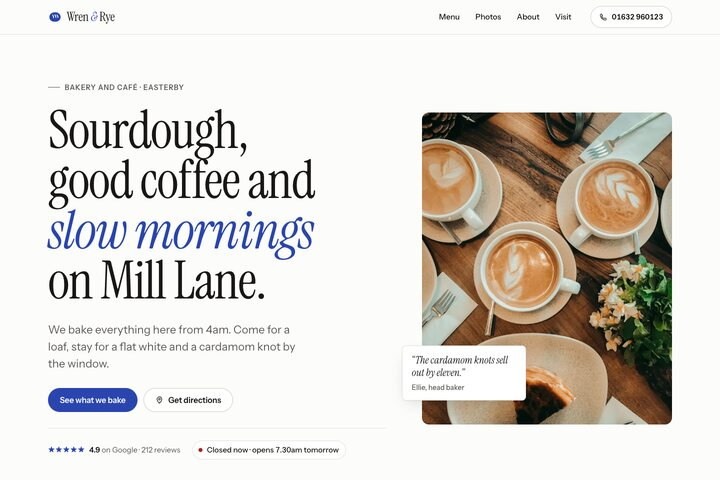
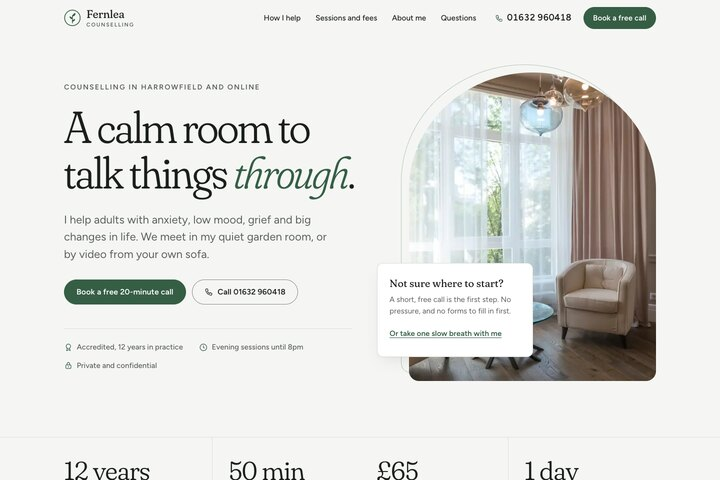
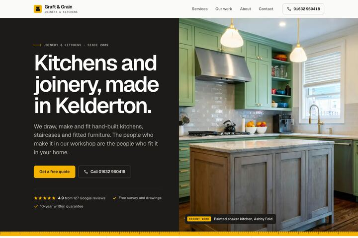

# Cloudflare starters for small businesses

Three website templates for UK small businesses. Each one runs on
Cloudflare's free plan, comes filled in for a made-up business, and has its
own **Deploy to Cloudflare** button. You press the button, then change the
words and photos to make the site yours. You do not need to write code. Each
folder's README tells you, or your AI assistant, exactly which file to edit.

| | Template | Deploy |
|---|---|---|
|  | [**`business-site`**](business-site) A one-page site for a café or shop: menu, photos, opening hours and an "Open now" badge. Files only, with no password to keep. |  |
|  | [**`contact-form`**](contact-form) A one-page site for a counsellor or therapist, with a spam-checked contact form and a private inbox for messages. |  |
|  | [**`small-business-site`**](small-business-site) A multi-page site for a trade business: services, our work, a before-and-after slider, a two-step quote form and an enquiry inbox. Every fact in one file. |  |

Full-page screenshots are in [`screenshots/`](screenshots).

Why Cloudflare, what else is free, and where the free plan falls short:
[17 things Cloudflare gives a small business for free](https://17things.co.uk/cloudflare-free-plan).

## Add a new template

Each template is one folder at the top of this repository. The Deploy button
copies only that folder, so each folder must work on its own.

1. **Make a folder** with a short, lower-case name, for example `salon-site`.
   Put in it everything the site needs: `package.json`, `wrangler.jsonc`, the
   site files and a `README.md`.
2. **Fill it in for a made-up business.** Use example.co.uk addresses and
   Ofcom drama phone numbers (01632 960xxx, 07700 900xxx). Credit every stock
   photo in `public/img/CREDITS.md`.
3. **Take two screenshots** of the example site at 1440 pixels wide and save
   them as JPGs in `screenshots/`:
   - `<folder>.jpg`: the top of the page, 720 × 480, about 50 KB.
   - `<folder>-full.jpg`: the whole page, 1200 pixels wide.
4. **Write the README** in the same order as the others: screenshot, who it
   suits, Deploy button, What you get, Make it yours, Passwords and keys,
   Costs and limits, Connect your domain, Files. In the README, show the
   screenshot from its full address,
   `https://raw.githubusercontent.com/17-Things/cloudflare-starters/main/screenshots/<folder>.jpg`,
   because the copied folder does not include `screenshots/`.
5. **Add a row** to the table above, with the thumbnail, one line and the
   Deploy button. The button link is
   `https://deploy.workers.cloudflare.com/?url=https://github.com/17-Things/cloudflare-starters/tree/main/<folder>`.

## Licences

The code is MIT. The example photos and the fonts are not: see
[LICENSE](LICENSE), each template's `public/img/CREDITS.md` and the licence
files next to each font.

Made by David Freeman, [17 Things](https://17things.co.uk).
